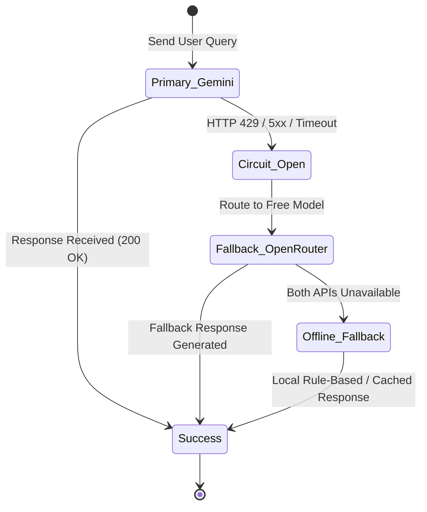

# J.A.R.V.I.S — API Rules & Integration Policy

## 1. Zero-Cost & Free Tier Mandate

The J.A.R.V.I.S architecture strictly prohibits reliance on paid or subscription-based APIs. All cloud and local services must adhere to zero-cost, open-source, or permanently free tier quotas.

```
+-------------------------------------------------------------+
|                J.A.R.V.I.S Service Providers               |
+------------------------------+------------------------------+
| Cloud AI:                    | Speech & Audio:              |
|  - Google Gemini (Free Tier) |  - OpenWakeWord (Local)      |
|  - OpenRouter (Free Models)  |  - Whisper (Local STT)       |
|                              |  - Edge-TTS (Free Neural TTS)|
+------------------------------+------------------------------+
```

---

## 2. Cloud LLM Providers & Configuration

### 2.1 Primary LLM: Google Gemini (Free Tier)
- **Official SDK:** Google GenAI Python SDK (`google-genai` / `google-generativeai`).
- **Primary Model Candidates:**
  - `gemini-2.0-flash` (Preferred for ultra-low latency, multi-modal reasoning, and tool calling).
  - `gemini-1.5-flash` (High throughput fallback).
- **Free Tier Quota Management:**
  - Standard free tier grants generous RPM (Requests Per Minute) and RPD (Requests Per Day).
  - Prompts must be token-efficient to maximize response speed and minimize quota consumption.

### 2.2 Fallback LLM: OpenRouter (Free Tier Models)
- **API Protocol:** OpenAI-compatible REST API endpoint (`https://openrouter.ai/api/v1`).
- **Target Free Models:**
  - `meta-llama/llama-3.3-70b-instruct:free`
  - `mistralai/mistral-7b-instruct:free`
  - `google/gemma-2-9b-it:free`
- **Activation Criteria:**
  - Auto-switches on Gemini HTTP 429 (Rate Limit Exceeded), HTTP 500/503 (Server Error), or network timeout.

---

## 3. Circuit Breaker & Failover Protocol



### 3.1 Failover Rules
1. **Exponential Backoff:** When a 429 is encountered, retry once after an initial backoff (e.g., 2.0s).
2. **Immediate Failover:** If the retry fails, instantly dispatch the query to the OpenRouter fallback client.
3. **Recovery Polling:** The circuit breaker attempts to restore Gemini as primary after a 60-second cooldown window.

---

## 4. Local & Free Speech Services

| Component | Technology | Cost / License | Resource Footprint |
| :--- | :--- | :--- | :--- |
| **Wake Word** | `openwakeword` | Apache 2.0 (Free & Local) | ~2% CPU, <50MB RAM |
| **Speech-to-Text** | `openai-whisper` / `faster-whisper` | MIT (Free & Local) | Runs on GPU/CPU |
| **Speech Synthesis** | `edge-tts` (Microsoft Edge Neural Voices) | Free & Unlimited | Streamed via HTTPS |

### Voice Personas Configuration
- **English Default:** `en-GB-RyanNeural` (Sophisticated British JARVIS accent) or `en-US-ChristopherNeural`.
- **Hindi Default:** `hi-IN-MadhurNeural` (Natural male Hindi voice) or `hi-IN-SwaraNeural`.

---

## 5. Environment Variables & Secret Management Contract

All external keys and configurations must be declared in `.env` (validated against `.env.example`):

```ini
# ==============================================================================
# J.A.R.V.I.S Environment Configuration
# ==============================================================================

# Core Application Settings
JARVIS_ENV=development
JARVIS_LOG_LEVEL=INFO
JARVIS_DEFAULT_LANGUAGE=en

# Cloud LLM Credentials (Free Tier)
GEMINI_API_KEY=your_gemini_api_key_here
GEMINI_PRIMARY_MODEL=gemini-2.0-flash

OPENROUTER_API_KEY=your_openrouter_api_key_here
OPENROUTER_FALLBACK_MODEL=meta-llama/llama-3.3-70b-instruct:free

# Audio & Speech Settings
WAKE_WORD_MODEL=jarvis
WHISPER_MODEL_SIZE=base
EDGE_TTS_VOICE_EN=en-GB-RyanNeural
EDGE_TTS_VOICE_HI=hi-IN-MadhurNeural

# Automation & Safety Guardrails
AUTOMATION_SAFETY_FAILSAFE=true
REQUIRE_CONFIRMATION_FOR_DELETION=true
```

---

## 6. Standardized Tool Calling Contract

All tools exposed to Gemini and OpenRouter must be defined using standard JSON Schemas to guarantee provider-agnostic execution:

```json
{
  "name": "manage_window",
  "description": "Control desktop window state (focus, minimize, maximize, close)",
  "parameters": {
    "type": "object",
    "properties": {
      "app_name": {
        "type": "string",
        "description": "Name or title of the target application window"
      },
      "action": {
        "type": "string",
        "enum": ["focus", "minimize", "maximize", "close"],
        "description": "Action to perform on the window"
      }
    },
    "required": ["app_name", "action"]
  }
}
```
