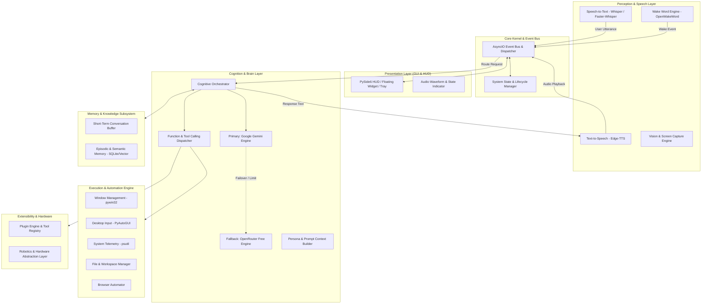
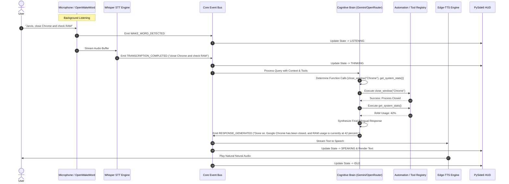

# J.A.R.V.I.S — System Architecture Document

## 1. High-Level Architecture Overview

J.A.R.V.I.S is structured around a **Layered, Event-Driven Micro-Kernel Architecture**. The architecture ensures strict separation of concerns, high maintainability, seamless pluggability, and real-time responsiveness.

---

## 2. Subsystem Breakdowns

### 2.1 Perception & Audio Pipeline
The perception layer processes raw audio and visual inputs in real time without blocking the main event loop.

- **Wake Word Detection (`app.perception.wake_word`):**
  - Continuous streaming audio capture via `pyaudio` or `sounddevice`.
  - Analyzed locally by `openwakeword` using pre-trained "Jarvis" / "Hey Jarvis" models.
  - Generates minimal CPU overhead during idle listening.
- **Speech-to-Text (`app.perception.stt`):**
  - Triggered upon wake-word confirmation or user manual push-to-talk.
  - Uses `openai-whisper` (or `faster-whisper` CTranslate2 backend) with local weights.
  - Automatically identifies and transcribes Hindi, English, and Hinglish utterances.
- **Text-to-Speech (`app.perception.tts`):**
  - Converts generated text responses into high-quality neural speech using `edge-tts`.
  - Configurable personas: English (`en-GB-RyanNeural`, `en-US-ChristopherNeural`), Hindi (`hi-IN-MadhurNeural`, `hi-IN-SwaraNeural`).
  - Supports non-blocking playback with interrupt capability when a new wake-word is detected.
- **Vision Capture (`app.perception.vision`):**
  - High-speed desktop screen capture and active window cropping using `Pillow` and `pywin32`.
  - Formats image payloads for multi-modal Gemini analysis.

---

### 2.2 Cognitive Brain & Reasoning Engine
The core brain orchestrates intent detection, multi-step planning, tool execution, and response synthesis.

- **Brain Orchestrator (`app.brain.orchestrator`):**
  - Coordinates conversational state, prompt history, memory retrieval, and LLM queries.
- **Primary Engine (`app.brain.providers.gemini`):**
  - Implements the official Google GenAI / Gemini API client.
  - Leverages `gemini-2.0-flash` / `gemini-1.5-flash` for high-speed reasoning and native tool/function calling.
- **Fallback Engine (`app.brain.providers.openrouter`):**
  - Circuit-breaker monitored client for OpenRouter free models (`meta-llama/llama-3.3-70b-instruct:free`, `mistralai/mistral-7b-instruct:free`).
  - Automatically activates when Gemini encounters rate limits (HTTP 429), server errors (HTTP 5xx), or network failure.
- **Tool Calling & Function Dispatcher (`app.brain.tools`):**
  - Standardized JSON Schema definition for all system capabilities.
  - Automatically inspects LLM tool call outputs, validates parameter contracts, executes corresponding backend methods, and feeds execution results back into the model context.

---

### 2.3 Desktop Automation & OS Engine
Provides native, system-level control over the operating system.

- **Window Management (`app.automation.windows`):**
  - Uses `pywin32` (Windows API bindings) to enumerate, minimize, maximize, snap, focus, and close application windows.
  - Tracks currently active foreground application to provide context to the LLM.
- **Input Simulation (`app.automation.input`):**
  - Uses `pyautogui` for mouse clicks, cursor movement, keyboard typing, hotkeys, and scroll events.
  - Built with failsafe screen boundaries and configurable delays.
- **System Monitoring (`app.automation.system`):**
  - Uses `psutil` to inspect CPU load, RAM usage, storage capacity, network stats, and battery status.
  - Enables commands like: *"Jarvis, check why my laptop is lagging"* -> identifies heavy background processes.
- **File System Manager (`app.automation.files`):**
  - Safe operations for reading, listing, searching, moving, and managing files across user directories.

---

### 2.4 Memory & Knowledge Subsystem
Maintains conversational continuity across sessions.

- **Working Memory (`app.memory.working`):**
  - Short-term sliding context window maintaining the active session's dialogue, recent tool outputs, and active application state.
- **Persistent Long-Term Memory (`app.memory.persistent`):**
  - SQLite database storing historical interactions, user preferences, custom facts, and scheduled reminders.
  - Lightweight vector/semantic search indexing for fast retrieval of relevant context.

---

### 2.5 Presentation Layer (PySide6 GUI / HUD)
A modern, Sci-Fi inspired desktop GUI built with **PySide6 (Qt 6)**.

- **Floating HUD Widget:** Semi-transparent, draggable, modern holographic/dark interface displaying Jarvis's current state (Listening, Thinking, Speaking, Executing).
- **Audio Waveform Visualizer:** Real-time visual feedback reflecting mic input and voice playback.
- **System Tray Integration:** Runs silently in the background with quick access to settings, logs, and toggle controls.
- **Asynchronous Qt-AsyncIO Bridge:** Employs `qasync` or dedicated Qt worker threads (`QThread`) emitting Qt signals to keep the UI smooth (60 FPS) without freezing during LLM or automation operations.

---

### 2.6 Extensibility & Robotics Subsystem (HAL)
- **Plugin Engine (`app.plugins`):**
  - Auto-discovers Python modules in a `plugins/` directory conforming to the `JarvisPlugin` base class.
  - Dynamically registers plugin functions into the LLM Tool Registry.
- **Robotics Hardware Abstraction Layer (`app.robotics`):**
  - Unified interface for serial communication (`pyserial`), MQTT, and WebSocket protocols.
  - Enables future control of microcontrollers (Arduino, ESP32, Raspberry Pi) for physical actuators, servo motors, and IoT sensors.

---

## 3. End-to-End Data Flow Sequence

---

## 4. Threading & Concurrency Architecture

To guarantee zero UI freezing and sub-second voice responsiveness:

1. **Main GUI Thread (Qt Event Loop):** Handles rendering, animations, user clicks, and visual state updates.
2. **Perception Thread (AsyncIO Loop):** Manages continuous audio capture, wake-word scoring, and audio streaming.
3. **Execution Worker Pool (`concurrent.futures.ThreadPoolExecutor`):** Offloads blocking OS operations (PyAutoGUI, file I/O, subprocesses) preventing interference with the event bus.
4. **Network Thread:** Handles asynchronous HTTP/WebSocket calls to Gemini and OpenRouter.
