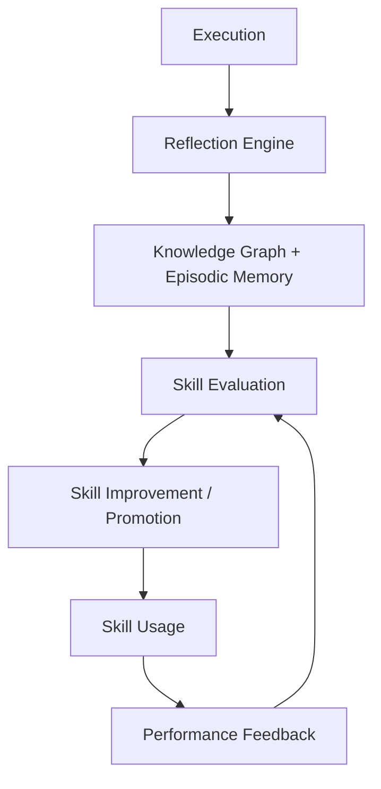
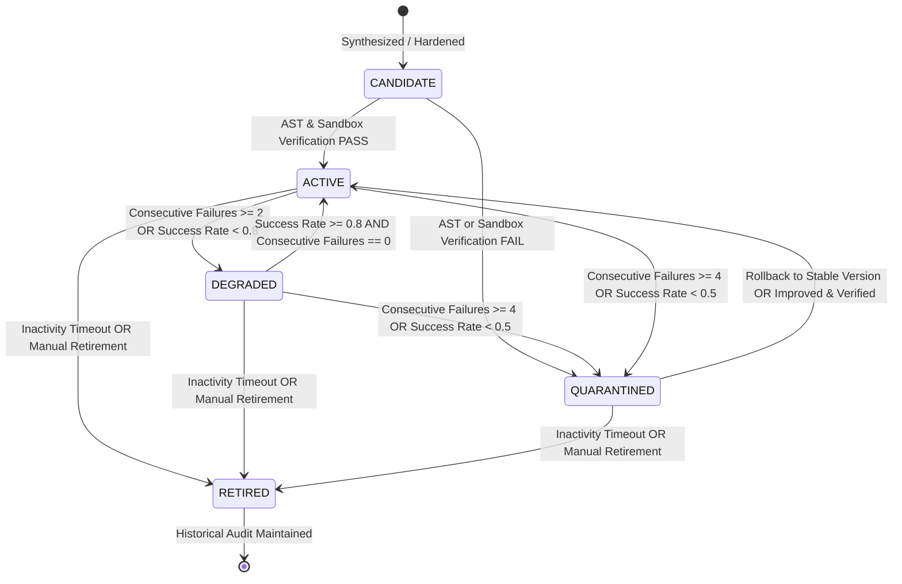

# Phase 21: Autonomous Learning & Skill Evolution

## 1. Executive Summary

Phase 21 introduces continuous, self-improving autonomous learning and skill lifecycle management to the J.A.R.V.I.S. Metacognitive subsystem. Building directly upon the foundation established in Phase 20 (Dynamic Tool Synthesis, Sandboxed Execution, Semantic Knowledge Graph, Causal Reflection, and Macro-Skill Compilation), Phase 21 completes the evolutionary loop:



Through a thread-safe, deterministic `SkillEvolutionEngine`, J.A.R.V.I.S. monitors runtime skill health, computes explainable quality scores without any LLM dependency, executes deterministic degradation and quarantine transitions, safeguards against regressions with automated rollbacks to verified stable versions, and prescribes autonomous code hardening via causal reflection and sandbox verification.

---

## 2. Core Architectural Principles

1. **Deterministic & Explainable Scoring**: All skill evaluation is strictly algorithmic based on mathematical weighting of success rate, reliability penalties, execution latency, and usage frequency. No non-deterministic LLM or random elements are used.
2. **Safe Versioning & Rollback**: Every skill maintains lightweight semantic versioning (`v1.0.0`, `v1.1.0`, etc.) and explicitly designates the latest verified stable version. If candidate or updated versions perform poorly, the engine executes an atomic rollback.
3. **Non-Destructive Quarantine & Retirement**: Quarantined and retired skills are barred from active execution selection, but their version records, metrics snapshots, and failure histories are preserved indefinitely for post-mortem analysis and auditability.
4. **Zero Global Mutable State & 100% Dependency Injection**: All state is localized to engine instances, protected by re-entrant locks (`threading.RLock`), and injected cleanly.
5. **Strict Security Enforcement**: Autonomous improvement never bypasses AST security validation (forbidden imports, calls, AST nodes) or ephemeral sandbox execution testing.

---

## 3. Data Models & State Machine

### 3.1 Lifecycle States (`SkillStatus`)

- `ACTIVE`: Skill is healthy, verified, and available for primary selection.
- `DEGRADED`: Skill has experienced repeated recent failures or low success rates. Selectable with warning/metadata.
- `QUARANTINED`: Skill has suffered severe consecutive failures or catastrophic unreliability. Isolated from active execution. Synchronized with `MacroSkillCompiler.quarantine_skill`.
- `CANDIDATE`: Newly generated or improved skill under verification. Ineligible for selection until promoted.
- `RETIRED`: Obsolete or inactive skill safely retired from execution without physical destruction of historical metadata.

### 3.2 State Transition Diagram



---

## 4. Deterministic Scoring Model

Skill quality is evaluated via a bounded, explainable scoring algorithm:

$$\text{Score} = 0.50 \cdot S + 0.25 \cdot R + 0.15 \cdot L + 0.10 \cdot U$$

Where:
1. **Success Rate ($S$)**:
   $$S = \begin{cases} 1.0 & \text{if } \text{invocations} = 0 \\ \frac{\text{success\_count}}{\text{invocation\_count}} & \text{otherwise} \end{cases}$$

2. **Reliability Factor ($R$)**:
   Penalizes consecutive failures:
   $$R = \max(0.0, 1.0 - 0.25 \cdot \text{consecutive\_failures})$$

3. **Latency Factor ($L$)**:
   Rewarding fast, sub-50ms execution:
   $$L = \begin{cases} 1.0 & \text{if } \bar{t} \le 50.0 \text{ ms} \\ \max\left(0.1, \min\left(1.0, 1.0 - \frac{\bar{t} - 50.0}{2000.0}\right)\right) & \text{otherwise} \end{cases}$$

4. **Usage Factor ($U$)**:
   Empirical maturity factor reaching saturation at 10 invocations:
   $$U = \begin{cases} 0.5 & \text{if } \text{invocations} = 0 \\ \min\left(1.0, \frac{\text{invocation\_count}}{10.0}\right) & \text{otherwise} \end{cases}$$

5. **Confidence Score**:
   $$\text{Confidence} = \text{Score} \cdot \min\left(1.0, \max\left(0.5, \frac{\text{invocation\_count}}{5.0}\right)\right)$$

---

## 5. Versioning and Rollback Mechanics

### 5.1 Version Progression
- Initial skill registration creates `v1.0.0` marked as `is_stable=True`.
- Subsequent improvements generate incremental minor versions (`v1.1.0`, `v1.2.0`).
- Each version record (`SkillVersionRecord`) stores:
  - `version`: Version string.
  - `callable_tool`: Executable Python callable.
  - `metadata`: Associated distillation/synthesis metadata.
  - `status`: Lifecycle state of this specific version.
  - `metrics_snapshot`: Frozen copy of `SkillMetrics` at version creation.
  - `created_at`, `retired_at`, `retirement_reason`.
  - `is_stable`: Boolean flag denoting verified stability.

### 5.2 Atomic Rollback Workflow (`rollback_skill`)
1. Locates the latest verified `stable_version` in `_stable_versions`.
2. Restores the stable version's callable into `MacroSkillCompiler.register_skill(overwrite=True)`.
3. Unquarantines the skill in `MacroSkillCompiler.unquarantine_skill`.
4. Resets `consecutive_failures = 0` and sets `status = SkillStatus.ACTIVE`.
5. Emits `SkillRollback(skill_name, restored_version, reason)`.
6. Preserves the failing candidate version record in historical tracking for auditability.

---

## 6. Autonomous Improvement Workflow

When a skill degrades or fails repeatedly:

```
1. Failure Signal Received in on_trajectory_completed
           ↓
2. Query CausalReflectionEngine for Failure Diagnosis
   (Extract root cause, description, invariant constraint, recommended action)
           ↓
3. Emit SkillImprovementStarted(skill_name, reason, prescription)
           ↓
4. Generate Hardened Candidate Version (e.g. v1.1.0)
           ↓
5. AST Security Scanning (SandboxedExecutionHarness.scan_ast_security)
   [Rejects: os, sys, subprocess, eval, exec, network calls]
           ↓
6. Ephemeral Sandbox Execution (SandboxedExecutionHarness.execute_in_sandbox)
           ↓
  ┌──────────────────────────────┴──────────────────────────────┐
  ↓ PASS                                                        ↓ FAIL
Promote to ACTIVE                                         Quarantine Candidate Version
Mark as stable_version                                    Preserve previous stable version
Emit SkillImprovementCompleted(verified=True)             Emit SkillImprovementCompleted(verified=False)
Emit SkillVersionPromoted(version, prev_version)
```

---

## 7. MetacognitiveController Integration

The `MetacognitiveController` seamlessly coordinates `SkillEvolutionEngine`:

- **Dependency Injection**: Optional `evolution_engine: Optional[SkillEvolutionEngine] = None` in constructor. When omitted, backwards compatibility with Phase 20 is 100% preserved.
- **Skill Registration**: Newly distilled macro-skills from `on_trajectory_completed` are automatically registered into `evolution_engine` as `v1.0.0` stable skills.
- **Execution Telemetry**: After each trajectory execution, duration and success/failure status are recorded into `evolution_engine`. If a skill degrades, an asynchronous task is submitted to `_bg_executor` to autonomously trigger `improve_skill`.
- **Selection Filtering**:
  - `find_matching_macro_skill` and `resolve_or_synthesize_action` check `is_skill_selectable(action_name)`.
  - `QUARANTINED` and `RETIRED` skills are strictly excluded from selection or re-synthesis.
  - `DEGRADED` skills remain selectable with warning logs.

---

## 8. Lifecycle Event System

The following strongly-typed, immutable `PlannerEvent` classes were added to `app/ai/planner/events.py`:

| Event Class | Payload Fields | Purpose |
|---|---|---|
| `SkillEvaluated` | `skill_name`, `score`, `status`, `recommendation` | Emitted when skill quality score is updated. |
| `SkillDegraded` | `skill_name`, `reason`, `consecutive_failures`, `score` | Emitted when repeated failures downgrade skill to `DEGRADED`. |
| `SkillQuarantined` | `skill_name`, `reason` | Emitted when critical failures isolate skill to `QUARANTINED`. |
| `SkillImprovementStarted` | `skill_name`, `reason`, `prescription` | Emitted when causal reflection starts improvement diagnosis. |
| `SkillImprovementCompleted` | `skill_name`, `version`, `verified`, `error` | Emitted when candidate sandbox verification finishes. |
| `SkillVersionPromoted` | `skill_name`, `version`, `previous_version` | Emitted when candidate becomes new active version. |
| `SkillRollback` | `skill_name`, `restored_version`, `reason` | Emitted when active version is rolled back to stable version. |
| `SkillRetired` | `skill_name`, `reason` | Emitted when obsolete skill is safely retired. |

---

## 9. Performance Benchmark Results

Measured on benchmark suite `benchmarks/metacognition_evolution_perf.py`:

| Benchmark Metric | Measured Performance | Architectural Budget | Status | Headroom Factor |
|---|---|---|---|---|
| **Metric Update Latency** | **1.983 µs** | < 50.0 µs | **PASS** | 25.2x faster |
| **Skill Evaluation Latency** | **9.181 µs** | < 50.0 µs | **PASS** | 5.4x faster |
| **Registry Lookup Latency** | **0.827 µs** | < 10.0 µs | **PASS** | 12.1x faster |
| **Version Lookup Latency** | **1.015 µs** | < 10.0 µs | **PASS** | 9.9x faster |
| **Concurrent Update Throughput** | **198,403 ops/s** | > 20,000 ops/s | **PASS** | 9.9x throughput |
| **Evolution Decision Latency** | **1.128 µs** | < 100.0 µs | **PASS** | 88.6x faster |

---

## 10. Verification and Regression Testing

- **Focused Unit Suite (`tests/test_metacognition_evolution.py`)**:
  - 19 test cases covering all 18 required scenarios, deterministic transitions, and security checks.
  - Result: **19/19 PASS** (0.368s).
- **Architecture Invariants (`tests/test_architecture.py`)**:
  - Validates zero global state, dependency injection, RLock isolation, and no illegal imports.
  - Result: **20/20 PASS** (0.259s).
- **Metacognitive Suite (`tests/test_metacognition_*.py`)**:
  - Covers sandbox, synthesizer, knowledge graph, reflection, compiler, and controller.
  - Result: **88/88 PASS** (4.491s).
- **Repository-Wide Full Regression (`tests/`)**:
  - Result: **821/821 PASS** (15.847s). Zero regressions across all phases (16 through 21).
