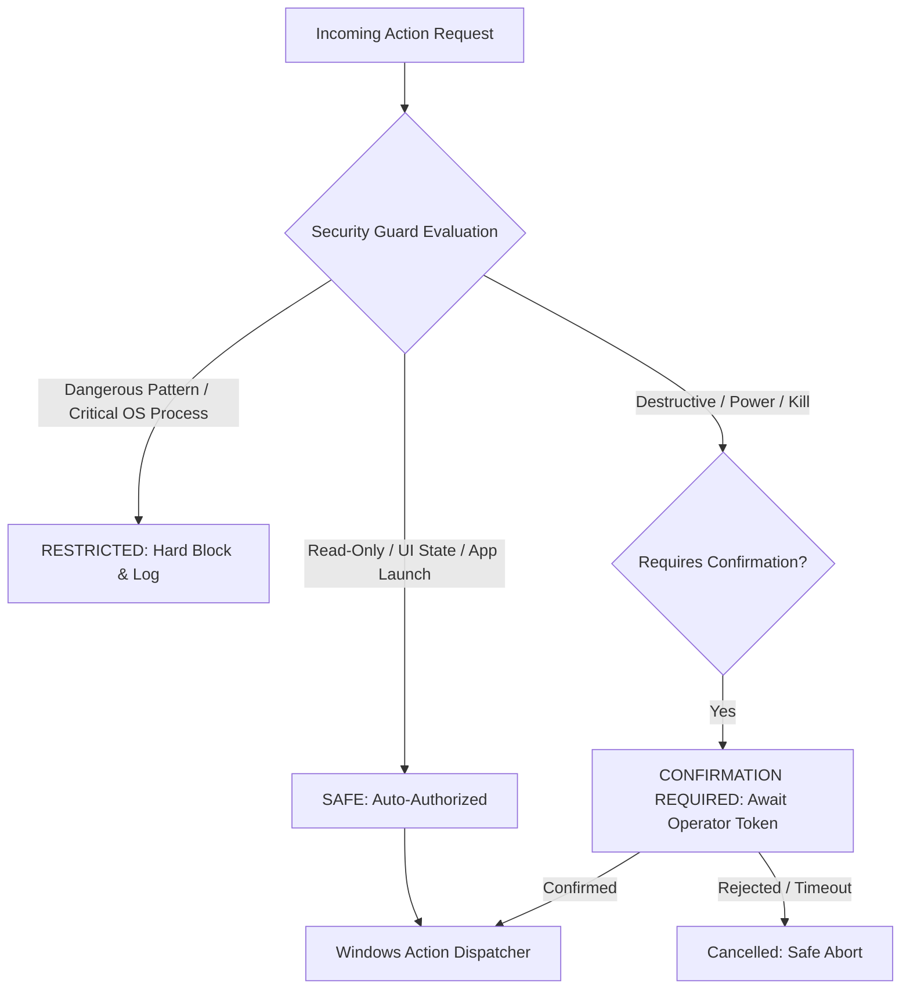

# Phase 22: Real PC / Windows System Skills — Implementation Plan

> **Status**: APPROVED ARCHITECTURE & PLANNING  
> **Target Version**: `v0.22.0`  
> **Prerequisites**: Phase 20 (Metacognition) & Phase 21 (Autonomous Learning & Skill Evolution) Verified Complete (821/821 Tests Passing)  
> **Execution Constraint**: Planning Step ONLY. No production code modified until explicit approval.

---

## 1. Executive Summary & Context

Phase 22 bridges J.A.R.V.I.S.'s cognitive planning, multi-agent orchestration, and autonomous skill evolution directly to **real, safe Windows PC operations**.

Instead of inventing a disjointed, parallel shell-execution framework or exposing an unrestricted command prompt, Phase 22 integrates directly into the existing J.A.R.V.I.S. architecture:

```
Voice / Text Intent
        ↓
CommandRouter / IntentRouter
        ↓
Planner (DAG Decomposition)
        ↓
Executor (Resolves via SkillManager / ServiceContainer)
        ↓
Phase 22 System Skills (Application, File, System Info, Control, Window, Browser)
        ↓
Security Guard & Permission Gateway (SAFE / CONFIRMATION REQUIRED / RESTRICTED)
        ↓
Windows Native Execution (ctypes user32/kernel32/shell32, standard library, psutil fallback)
        ↓
Structured Execution Result
        ↓
MetacognitiveController & Causal Reflection
        ↓
SkillEvolutionEngine (Metrics, Quality Scoring, Degradation, Versioning & Rollback)
```

---

## 2. Current Architecture Audit & Existing Reusable Assets

A comprehensive audit of the repository reveals substantial, high-quality foundations that can be leveraged without redundant duplication:

| Subsystem / Component | File Location | Existing Capability | Phase 22 Reuse Strategy |
|---|---|---|---|
| **BaseSkill Contract** | `app/skills/base.py` | `BaseSkill` abstract class with priority, tags, permissions, lifecycle hooks (`initialize`, `shutdown`), `bind()`, `can_handle()`, `execute()`, `execute_async()`. | All Phase 22 system skills inherit from `BaseSkill`. |
| **SkillManager** | `app/skills/manager.py` | Thread-safe skill registry, priority-based intent routing, dynamic recursive discovery (`discover()`), enable/disable control, event broadcasting. | Hosts and discovers all Phase 22 system skills. |
| **Existing SystemSkill** | `app/skills/system_skill.py` | Priority 50 skill handling basic CPU, RAM, Disk, Battery queries, top processes, open app, kill process. | Retained as backward-compatible facade delegating to specialized Phase 22 modular system skills. |
| **OS Automation Primitives** | `app/automation/system.py` | `SystemMonitor` collecting CPU, RAM, Disk, Battery with `psutil` and standard library fallbacks. | Enhanced for GPU, network telemetry, and detailed disk partitions. |
| **Window & Process Automation** | `app/automation/windows.py` | `WindowManager` handling app launching via aliases, process finding, process termination, foreground window query via `ctypes`. | Enhanced for window enumeration, focus, minimize, maximize, restore, and close. |
| **Security Guardrails** | `app/automation/guardrails.py` | `SecurityGuard` enforcing `CRITICAL_SYSTEM_PROCESSES` protection (smss, csrss, wininit, lsass, svchost, explorer, dwm) and blocked exec patterns. | Upgraded to enforce the 3-tier security model (SAFE, CONFIRMATION REQUIRED, RESTRICTED). |
| **Human-in-the-Loop Gateway** | `app/ai/planner/swarm/hitl.py` | `InterventionGateway`, `ApprovalDecision`, `RiskLevel` (`LOW`, `MEDIUM`, `HIGH`, `CRITICAL`), request tracking, event publishing (`InterventionRequested`, `InterventionResolved`). | Reused for system skill confirmation workflows. |
| **Swarm Policy Engine** | `app/ai/planner/swarm/policy.py` | `SwarmPolicyEngine` enforcing action allowlists, denied regex patterns, and rate limits. | Integrated to prevent command injection and recursive abuse. |
| **Plan Executor** | `app/ai/planner/executor.py` | DAG execution engine with multi-tier action resolution: handlers -> `SkillManager` -> `ServiceContainer` -> dynamic synthesizer. | Resolves Phase 22 actions natively via `SkillManager` and alias mappings. |
| **Metacognitive Controller** | `app/ai/planner/metacognition/controller.py` | Master controller orchestrating tool resolution, trajectory feedback, causal reflection on failure, macro distillation. | Automatically receives Phase 22 execution telemetry. |
| **Skill Evolution Engine** | `app/ai/planner/metacognition/evolution.py` | Per-skill metrics, deterministic scoring, degradation, quarantine, versioning, and rollback. | Tracks Phase 22 skill reliability, degrading unreliable skills and rolling back if necessary. |
| **Intent Router** | `app/ai/intent_router.py` | Rule-based classifier with existing rules for `IntentType.SYSTEM` and `IntentType.FILE`. | Directly routes user commands to Phase 22 skills with zero latency. |
| **Event Bus** | `app/core/event_bus.py` & `app/ai/planner/events.py` | Dual pub-sub architecture for system telemetry and strongly-typed planner observability. | Emits Phase 22 execution and confirmation events. |

---

## 3. Skill Taxonomy: Categorization & Capability Matrix

Phase 22 organizes system capabilities into six modular categories under `app/skills/system/`:

```
app/skills/system/
├── __init__.py               # Re-exports all system skills and container wiring
├── base_system_skill.py      # Abstract base for system skills with safety & confirmation hooks
├── app_skills.py             # Application lifecycle management
├── file_skills.py            # Local filesystem operations with path containment
├── info_skills.py            # System, hardware, and network telemetry
├── control_skills.py         # Audio volume, brightness, power state control
├── window_skills.py          # Desktop window enumeration, focus, and state control
├── browser_skills.py         # Web navigation, URL dispatch, and browser queries
└── security.py               # 3-Tier Security Policy and Confirmation Manager
```

### 3.1 Category A: Application Skills (`AppSkills`)
- **`open_app(app_name, parameters=None)`**: Launch known desktop apps, system tools, or custom executables via allowlist / standard paths.
- **`close_app(app_name, force=False)`**: Gracefully close an application (sends `WM_CLOSE` to top-level windows); force terminates process only if requested and authorized.
- **`restart_app(app_name)`**: Sequentially terminate and re-launch an application.
- **`is_app_running(app_name)`**: Query whether an application process is active.
- **`list_running_apps()`**: Return a filtered list of user-facing desktop applications (excluding background daemons).

### 3.2 Category B: File & Folder Skills (`FileSkills`)
- **`create_folder(path)`**: Create directory tree (`pathlib.Path.mkdir(parents=True, exist_ok=True)`).
- **`create_file(path, content="")`**: Create and write text file safely with path containment validation.
- **`read_file(path, max_bytes=65536)`**: Read text file with encoding safety (UTF-8, Latin-1 fallback).
- **`list_directory(path=".", limit=100, pattern="*")`**: List directory contents with metadata (size, modified time, is_dir).
- **`rename_path(source, target)`**: Rename file or directory.
- **`move_path(source, target)`**: Move file or directory with overwrite check.
- **`copy_path(source, target)`**: Copy file or directory tree.
- **`delete_path(path)`**: **CONFIRMATION REQUIRED**. Send to Windows Recycle Bin via `SHFileOperationW` (`FOF_ALLOWUNDO`) or require explicit user confirmation before permanent removal.
- **`open_in_explorer(path)`**: Open Windows File Explorer focused on the specified folder or file.

### 3.3 Category C: System Information Skills (`SystemInfoSkills`)
- **`get_cpu_info()`**: CPU utilization percentage, logical/physical core counts, clock frequency.
- **`get_memory_info()`**: Total RAM, used RAM, available RAM, swap usage, utilization percentage.
- **`get_disk_info(path=None)`**: Partition mount points, total storage, free space, percentage used.
- **`get_battery_info()`**: Battery percentage, charging status (AC plugged), estimated time remaining.
- **`get_gpu_info()`**: GPU device name, driver version, memory usage (via `nvidia-smi` subprocess or Windows DXGI/WMI safe query).
- **`get_network_info()`**: Local IP address, hostname, active network interface, default gateway, and internet connectivity ping.
- **`get_system_summary()`**: Aggregated one-shot health and diagnostic report.

### 3.4 Category D: System Control Skills (`SystemControlSkills`)
- **`get_volume()`**: Retrieve current master audio volume percentage (0–100) and mute status.
- **`set_volume(level)`**: Set master volume to specified percentage (clamped to 0–100).
- **`volume_up(step=5)`**: Increment audio volume.
- **`volume_down(step=5)`**: Decrement audio volume.
- **`mute_volume()` / `unmute_volume()`**: Toggle or explicitly set audio mute state.
- **`get_brightness()`**: Query display brightness percentage (via WMI/DDC-CI where supported).
- **`set_brightness(level)`**: Set display brightness percentage (0–100).
- **`lock_workstation()`**: Lock the Windows desktop immediately (`ctypes.windll.user32.LockWorkStation()`). **SAFE**.
- **`sleep_system()`**: **CONFIRMATION REQUIRED**. Put the system to sleep (`SetSuspendState`).
- **`restart_system(delay_seconds=0)`**: **CONFIRMATION REQUIRED**. Restart Windows (`shutdown /r`).
- **`shutdown_system(delay_seconds=0)`**: **CONFIRMATION REQUIRED**. Shut down Windows (`shutdown /s`).

### 3.5 Category E: Window Management Skills (`WindowSkills`)
- **`list_windows(visible_only=True)`**: Enumerate all desktop windows with handle (HWND), title, process ID, and process name.
- **`get_active_window()`**: Return details of the currently focused foreground window.
- **`focus_window(title_or_hwnd)`**: Bring target window to the foreground (`SetForegroundWindow`).
- **`minimize_window(title_or_hwnd)`**: Minimize window (`ShowWindow(SW_MINIMIZE)`).
- **`maximize_window(title_or_hwnd)`**: Maximize window (`ShowWindow(SW_MAXIMIZE)`).
- **`restore_window(title_or_hwnd)`**: Restore window from minimized/maximized state (`ShowWindow(SW_RESTORE)`).
- **`close_window(title_or_hwnd)`**: Send polite close signal (`PostMessage(WM_CLOSE)`).

### 3.6 Category F: Browser & Web Launch Skills (`BrowserSkills`)
- **`open_url(url)`**: Open target URL in the default or specified browser with strict scheme validation (`http://`, `https://`).
- **`search_web(query, engine="google")`**: URL-encode search query and launch default browser (e.g. `https://www.google.com/search?q=...`).
- **`open_browser(browser="default")`**: Launch the default or requested browser application (Chrome, Edge, Firefox).

---

## 4. Security Model & Policy Boundaries

Security is paramount. The system must **never** expose an unrestricted shell or arbitrary code executor.



### 4.1 Classification Tiers

#### Tier 1: SAFE (Automatic Execution)
- All read-only hardware, OS, and telemetry queries (CPU, RAM, Disk, Battery, GPU, Network).
- Listing processes, visible windows, directory contents.
- Non-destructive UI operations: focusing/minimizing/maximizing/restoring windows, locking workstation.
- Launching recognized desktop applications from allowlist or registered Windows paths.
- Opening validated URLs in the default browser.

#### Tier 2: CONFIRMATION REQUIRED (Interactive Authorization)
- Deleting files or directories (`delete_path`).
- Overwriting or moving existing files across different roots.
- Terminating user processes (`close_app`, `terminate_process`).
- System power modifications: `shutdown_system`, `restart_system`, `sleep_system`.
- Extreme system volume settings (e.g. jumping to 100%).

#### Tier 3: RESTRICTED (Permanently Blocked)
- Terminating critical Windows processes (`smss.exe`, `csrss.exe`, `wininit.exe`, `services.exe`, `lsass.exe`, `winlogon.exe`, `dwm.exe`, `explorer.exe`, `svchost.exe`, current python process).
- Raw shell injection patterns (`format`, `rm -rf`, `del /f /s /q`, fork bombs, piping to `powershell -enc`).
- Path traversal targeting Windows system roots (`C:\Windows`, `C:\Windows\System32`, `C:\ProgramData\Microsoft`).
- Execution of untrusted scripts or arbitrary binaries without explicit absolute paths or known extensions (`.exe`, `.cmd`).

---

## 5. Confirmation & Human-in-the-Loop (HITL) Workflow

When an action is identified as `CONFIRMATION_REQUIRED`:

1. **Gate Evaluation**:
   The skill checks `SystemSecurityPolicy.is_confirmation_required(action, target)`.
2. **Request Generation**:
   A unique `confirmation_id` (e.g. `conf_7a8b9c`) is created with action details, target, risk description, and a 30-second expiry.
3. **Operator Interaction**:
   - **Console / Interactive Mode**: Displays clear warning:
     `"Action 'shutdown_system' requires confirmation. Proceed? (yes/no): "`
   - **HITL Integration**: Reuses `InterventionGateway.request_approval()` emitting `InterventionRequested`.
   - **Voice / Automated Mode**: Returns structured response prompting the user:
     `"Shutting down the PC requires confirmation. Should I proceed?"`
4. **Resolution**:
   - **Affirmative** (`yes`, `y`, `confirm`, `proceed`): The action is executed and logged.
   - **Negative** (`no`, `n`, `cancel`, `abort`): Operation is cancelled without side effects.
   - **Timeout** (30s elapsed): Automatically auto-rejected.

---

## 6. Windows API & Portability Strategy

To keep J.A.R.V.I.S. lightweight, robust, and zero-dependency where possible:

| Capability Area | Preferred Implementation | Fallback / Alternative | Rationale |
|---|---|---|---|
| **Window Management** | Standard library `ctypes.windll.user32` (`EnumWindows`, `GetWindowTextW`, `SetForegroundWindow`, `ShowWindow`, `PostMessageW`) | Non-Windows: stub returning graceful notice | Standard library built into Windows Python; zero external packages required. |
| **Lock Workstation** | `ctypes.windll.user32.LockWorkStation()` | None needed | Instant, native, 100% reliable. |
| **Process Inspection** | `psutil` if installed | Standard library `subprocess.check_output(["tasklist", "/FO", "CSV"])` | Works whether `psutil` is installed or not. |
| **Process Termination** | `psutil.Process.terminate()` | Standard library `subprocess.run(["taskkill", "/PID", pid])` | Works without crashing if `psutil` is omitted. |
| **File Operations** | `pathlib.Path`, `os`, `shutil` | Windows Recycle Bin via `ctypes.windll.shell32.SHFileOperationW` | Standard library file operations with optional native Recycle Bin undo. |
| **Volume Control** | `ctypes.windll.user32.keybd_event` (VK_VOLUME_UP, VK_VOLUME_DOWN, VK_VOLUME_MUTE) | Windows Core Audio APIs via `ctypes` | Zero-dependency keyboard event emulation works instantly across all Windows versions. |
| **Brightness** | PowerShell CIM query via `subprocess.run(["powershell", "-NoProfile", "-Command", "Get-CimInstance ..."])` with strict parameterization | Graceful "unsupported hardware" notice | Native Windows WMI interface without external libraries. |
| **Power Operations** | `subprocess.run(["shutdown", "/s", "/t", str(delay)])` | `ctypes.windll.PowrProf.SetSuspendState` for sleep | Standard Windows shutdown utility with timeout abort capability (`shutdown /a`). |
| **Browser & URL** | Standard library `webbrowser.open(url)` | `os.startfile(url)` on Windows | Cross-browser, standard library, opens default user browser safely. |

---

## 7. File-by-File Change Plan

### 7.1 New Files to Create

1. **`app/skills/system/__init__.py`**:
   Package init re-exporting all system skills, registering with `SkillManager` and `ServiceContainer`.
2. **`app/skills/system/security.py`**:
   `SystemSecurityPolicy` and `SystemConfirmationManager` enforcing action tiers (SAFE, CONFIRMATION REQUIRED, RESTRICTED), path containment, process protection, and confirmation tokens.
3. **`app/skills/system/base_system_skill.py`**:
   `BaseSystemSkill` extending `BaseSkill` with unified confirmation checking, timing, error formatting, and event publishing.
4. **`app/skills/system/app_skills.py`**:
   `AppSkills` (`open_app`, `close_app`, `restart_app`, `is_app_running`, `list_running_apps`).
5. **`app/skills/system/file_skills.py`**:
   `FileSkills` (`create_folder`, `create_file`, `read_file`, `list_directory`, `rename_path`, `move_path`, `copy_path`, `delete_path`, `open_in_explorer`).
6. **`app/skills/system/info_skills.py`**:
   `SystemInfoSkills` (`get_cpu_info`, `get_memory_info`, `get_disk_info`, `get_battery_info`, `get_gpu_info`, `get_network_info`, `get_system_summary`).
7. **`app/skills/system/control_skills.py`**:
   `SystemControlSkills` (`get_volume`, `set_volume`, `volume_up`, `volume_down`, `mute_volume`, `unmute_volume`, `get_brightness`, `set_brightness`, `lock_workstation`, `sleep_system`, `restart_system`, `shutdown_system`).
8. **`app/skills/system/window_skills.py`**:
   `WindowSkills` (`list_windows`, `get_active_window`, `focus_window`, `minimize_window`, `maximize_window`, `restore_window`, `close_window`).
9. **`app/skills/system/browser_skills.py`**:
   `BrowserSkills` (`open_url`, `search_web`, `open_browser`).
10. **`tests/test_system_skills_app.py`**:
    Unit tests for application skills (launch, running check, termination, security blocking).
11. **`tests/test_system_skills_file.py`**:
    Unit tests for file & directory operations, path traversal rejection, deletion confirmation.
12. **`tests/test_system_skills_info.py`**:
    Unit tests for CPU, RAM, Disk, Battery, GPU, and Network telemetry collection.
13. **`tests/test_system_skills_control.py`**:
    Unit tests for volume, brightness, lock, power confirmation, and shutdown safety.
14. **`tests/test_system_skills_window.py`**:
    Unit tests for window listing, focus, minimization, maximization, and closing.
15. **`tests/test_system_skills_browser.py`**:
    Unit tests for URL opening, search engine query formatting, and scheme validation.
16. **`tests/test_system_security.py`**:
    Unit tests for 3-tier security policy, confirmation gateway, allowlists, and blocklists.
17. **`benchmarks/system_skills_perf.py`**:
    Microsecond latency benchmark for system skill dispatch, validation, telemetry, and window lookup.
18. **`docs/PHASE_22_REAL_PC_SKILLS.md`**:
    Comprehensive user guide and API specification for all Phase 22 PC skills.

### 7.2 Existing Files to Modify

1. **`app/skills/system_skill.py`**:
   Keep backward-compatible: update `SystemSkill` to aggregate and delegate queries to the new modular system skill suite while preserving existing test signatures.
2. **`app/ai/planner/executor.py`**:
   Update `_resolve_from_skill_manager` alias map to support Phase 22 action identifiers (`file_operation`, `window_control`, `volume_control`, `system_info`, etc.).
3. **`app/ai/planner/events.py`**:
   Add optional Phase 22 lifecycle telemetry events (`SystemSkillStarted`, `SystemSkillCompleted`, `SystemSkillFailed`, `SystemSkillConfirmationRequired`).
4. **`tests/test_architecture.py`**:
   Add `test_system_skills_isolation()` ensuring zero global mutable state, strict dependency injection, and clean boundaries.

---

## 8. Sub-Phase Implementation Roadmap

```
Phase 22.1: Foundation, Security Policy & Confirmation Gateway
     ↓
Phase 22.2: Application Skills (Launch, Detect, Close, Restart)
     ↓
Phase 22.3: File & Folder Skills (Create, Read, List, Move, Copy, Delete)
     ↓
Phase 22.4: System Information Skills (CPU, RAM, Disk, Battery, GPU, Network)
     ↓
Phase 22.5: System Control Skills (Volume, Brightness, Lock, Shutdown/Restart)
     ↓
Phase 22.6: Window Management Skills (List, Focus, Minimize, Maximize, Close)
     ↓
Phase 22.7: Browser & Web Skills (URL Dispatch, Web Search, Browser Launch)
     ↓
Phase 22.8: Planner, Executor & Metacognition Integration
     ↓
Phase 22.9: Benchmark Suite, Documentation & Repository Regression Validation
```

### Sprint 22.1: Foundation, Security Policy & Confirmation Gateway
- Create `app/skills/system/security.py` and `app/skills/system/base_system_skill.py`.
- Implement `SystemSecurityPolicy`: SAFE, CONFIRMATION REQUIRED, RESTRICTED action evaluation.
- Implement `SystemConfirmationManager`: token-based approval requests, 30s timeout, affirmative/negative parsing.
- Unit Tests: `tests/test_system_security.py`.

### Sprint 22.2: Application Skills
- Create `app/skills/system/app_skills.py`.
- Implement `open_app`, `close_app`, `restart_app`, `is_app_running`, `list_running_apps`.
- Integrate allowlist matching and alias resolution.
- Unit Tests: `tests/test_system_skills_app.py` (with subprocess and taskkill mocks).

### Sprint 22.3: File & Folder Skills
- Create `app/skills/system/file_skills.py`.
- Implement safe path operations with path containment validation.
- Enforce `CONFIRMATION_REQUIRED` on `delete_path`.
- Unit Tests: `tests/test_system_skills_file.py` (using `tempfile.TemporaryDirectory`).

### Sprint 22.4: System Information Skills
- Create `app/skills/system/info_skills.py`.
- Implement CPU, RAM, Disk, Battery, GPU, Network, and aggregated diagnostics.
- Ensure graceful fallbacks when `psutil` or dedicated GPU is absent.
- Unit Tests: `tests/test_system_skills_info.py`.

### Sprint 22.5: System Control Skills
- Create `app/skills/system/control_skills.py`.
- Implement Volume (up, down, mute, unmute, set), Brightness, Workstation Lock.
- Implement Sleep, Restart, Shutdown with mandatory confirmation.
- Unit Tests: `tests/test_system_skills_control.py` (with mocks for shutdown and keybd_event).

### Sprint 22.6: Window Management Skills
- Create `app/skills/system/window_skills.py`.
- Implement `list_windows`, `get_active_window`, `focus_window`, `minimize_window`, `maximize_window`, `restore_window`, `close_window` via `ctypes.windll.user32`.
- Unit Tests: `tests/test_system_skills_window.py` (with `user32` mock fixtures).

### Sprint 22.7: Browser & Web Skills
- Create `app/skills/system/browser_skills.py`.
- Implement URL opening, search engine dispatch, URL encoding, scheme validation.
- Unit Tests: `tests/test_system_skills_browser.py` (with `webbrowser.open` mock).

### Sprint 22.8: Planner, Executor & Metacognition Integration
- Update `app/skills/system/__init__.py` and `app/skills/system_skill.py`.
- Wire into `Executor._resolve_from_skill_manager` and `ServiceContainer`.
- Verify execution feedback loop into `MetacognitiveController` and `SkillEvolutionEngine`.

### Sprint 22.9: Benchmarks, Documentation & Final Regression
- Create `benchmarks/system_skills_perf.py`.
- Create `docs/PHASE_22_REAL_PC_SKILLS.md`.
- Update `tests/test_architecture.py`.
- Verify 100% repository-wide test pass rate (all 821 existing + all Phase 22 tests).

---

## 9. Test & Safety Strategy

To prevent unintended changes to the developer's workstation during automated testing:
1. **Mocking Dangerous Operations**:
   - `shutdown /s`, `shutdown /r`, `rundll32 powrprof.dll` must ALWAYS be mocked in unit tests.
   - Process termination (`taskkill`, `proc.kill`) must target mocked PIDs or temporary test processes.
2. **Isolated Filesystem Fixtures**:
   - All file and directory tests must execute exclusively inside isolated `tempfile.TemporaryDirectory()` trees.
   - Tests attempting path traversal outside temporary directories will assert `SecurityBlockedError`.
3. **Hardware / OS Mocking**:
   - `keybd_event` and `user32.ShowWindow` calls are verified via mock assertions in headless/automated test runners.
   - Network connectivity checks mock socket timeouts to avoid relying on external internet connectivity.

---

## 10. Performance Budgets

| Operation | Target Budget | Rationale |
|---|---|---|
| **Skill Intent Resolution (`can_handle`)** | < 100.0 µs | Fast regex/keyword matching before routing |
| **Security Policy Evaluation** | < 50.0 µs | Microsecond check of allowlists and protected process sets |
| **System Telemetry Collection (CPU+RAM+Disk)** | < 15.0 ms | Near-instantaneous response for voice loop |
| **Window Listing & Filtering** | < 25.0 ms | Fast desktop enumeration across open windows |
| **Volume / Window Control Command Dispatch** | < 5.0 ms | Sub-perceptual latency for user control commands |
| **File Operation (Single File CRUD)** | < 10.0 ms | Standard filesystem I/O latency |

---

## 11. Backward Compatibility Guarantees

1. **Existing Skills**: `AISkill`, `SystemSkill`, and custom mock skills continue to function without modification.
2. **Planner Invariants**: `KNOWN_ACTIONS` in `app/ai/planner/planner.py` remains valid; `Executor` resolves new Phase 22 actions dynamically via `SkillManager`.
3. **Metacognitive Subsystem**: `ToolSynthesizer`, `MacroSkillCompiler`, `CausalReflectionEngine`, and `SkillEvolutionEngine` continue operating seamlessly.
4. **Zero Global Mutable State**: All Phase 22 skills and security policies are instantiated through dependency injection and protected by re-entrant locks (`threading.RLock`).

---

## 12. Definition of Done (DoD)

Phase 22 will be deemed complete only when:
- [ ] All six skill categories (App, File, System Info, Control, Window, Browser) are fully implemented and verified.
- [ ] The 3-tier security model (SAFE, CONFIRMATION REQUIRED, RESTRICTED) is enforced across all operations.
- [ ] All critical OS processes and dangerous command strings are strictly protected.
- [ ] Confirmation gateway works for all destructive/power operations.
- [ ] All new unit tests pass with zero flakiness.
- [ ] Architecture isolation tests in `tests/test_architecture.py` pass.
- [ ] All Phase 22 performance benchmarks meet their defined budgets.
- [ ] Full repository-wide test suite passes with **zero regressions** (821 + new tests).
- [ ] Comprehensive documentation in `docs/PHASE_22_REAL_PC_SKILLS.md` is published.
