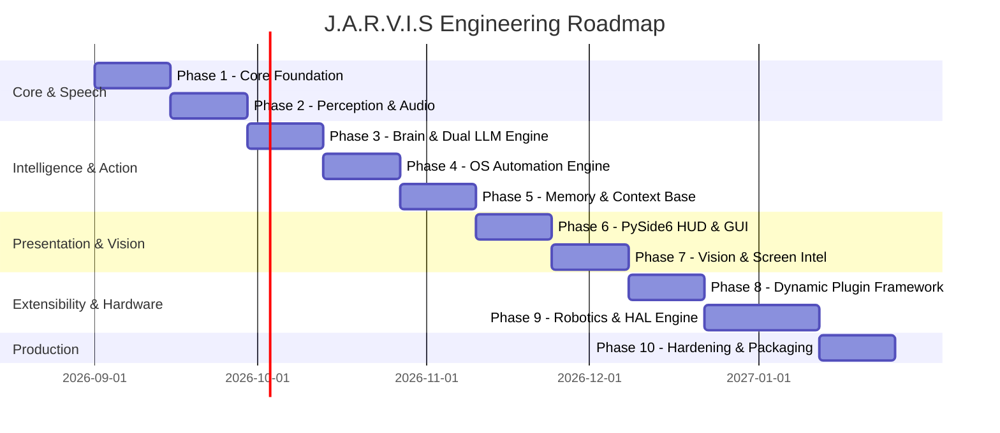

# J.A.R.V.I.S — Strategic Engineering Roadmap

## 1. Roadmap Overview & Milestones

The J.A.R.V.I.S project is planned across **10 structured engineering phases** designed to transition the system from a foundational event loop into a fully autonomous, production-ready AI Desktop Operating System Assistant.

---

## 2. Phase-by-Phase Breakdown

### Phase 1: Core Foundation & Configuration Engine
**Objective:** Build the non-blocking event-driven core infrastructure, logging, and environment configuration.
- [ ] Initialize Python 3.13 project structure and type-safe data models.
- [ ] Implement asynchronous internal Event Bus (`app.core.events`).
- [ ] Implement central Config Loader (`app.core.config`) using `python-dotenv` with strict validation.
- [ ] Establish structured logging system with auto-rotating file handlers and ANSI colored terminal output.
- [ ] Implement state management lifecycle (Startup -> Idle -> Listening -> Thinking -> Executing -> Speaking -> Shutdown).

---

### Phase 2: Perception & Audio Pipeline
**Objective:** Implement real-time voice activation, multilingual STT, and neural speech synthesis.
- [ ] Implement `openwakeword` engine for continuous, low-power "Hey Jarvis" / "Jarvis" detection.
- [ ] Implement `Whisper` / `faster-whisper` STT worker with Hindi, English, and Hinglish auto-detection.
- [ ] Implement `edge-tts` speech synthesizer with configurable bilingual voice personas.
- [ ] Build audio streaming manager with barge-in / interrupt capability (stops speaking when user interrupts).
- [ ] Unit tests for audio buffer management and mock STT/TTS pipelines.

---

### Phase 3: Cognitive Brain & Dual LLM Engine
**Objective:** Create the reasoning core powered by Google Gemini with OpenRouter fallback and tool calling.
- [ ] Build Gemini Provider client with `gemini-2.0-flash` / `gemini-1.5-flash`.
- [ ] Build OpenRouter Fallback Provider client with free models (`meta-llama/llama-3.3-70b-instruct:free`, etc.).
- [ ] Implement Circuit Breaker & Retry Manager with exponential backoff on HTTP 429/5xx.
- [ ] Create standardized Tool Registry and JSON Schema dispatcher for function calling.
- [ ] Build Prompt & Persona Engine supporting Jarvis persona in English and Hindi.

---

### Phase 4: OS Automation & System Management
**Objective:** Empower Jarvis with direct control over the operating system environment.
- [ ] Implement Window Manager (`pywin32`) to find, focus, minimize, maximize, and tile active application windows.
- [ ] Implement Desktop Input Automation (`pyautogui`) for keyboard shortcuts, typing, and mouse interactions.
- [ ] Implement System Telemetry Monitor (`psutil`) for CPU, RAM, disk, network, and running process diagnostics.
- [ ] Implement Safe File System Manager for searching, reading, moving, and organizing workspace files.
- [ ] Build security guardrails to block destructive system commands without explicit confirmation.

---

### Phase 5: Memory, Context & Knowledge Base
**Objective:** Enable persistent user memory, conversation history, and contextual recall across sessions.
- [ ] Implement Short-Term Working Memory buffer with sliding context window.
- [ ] Implement Persistent SQLite Database (`data/jarvis.db`) for storing user facts, past sessions, and preferences.
- [ ] Implement lightweight semantic search / vector retrieval for past interactions.
- [ ] Build user profile manager (user name, language preferences, favorite apps, custom routines).

---

### Phase 6: Presentation Layer & PySide6 Sci-Fi HUD
**Objective:** Deliver a sleek, futuristic, and responsive desktop HUD interface.
- [ ] Build draggable, frameless PySide6 floating HUD widget with glowing aesthetic.
- [ ] Integrate real-time audio waveform visualizer synced to mic input and TTS output.
- [ ] Implement System Tray icon with context menu (Status, Mute, Settings, Quit).
- [ ] Connect Qt Signals/Slots to the AsyncIO event bus using non-blocking worker threads.
- [ ] Build visual overlay for toast notifications and action confirmations.

---

### Phase 7: Vision & Screen Intelligence
**Objective:** Give Jarvis real-time sight to see and understand the user's screen.
- [ ] Implement high-speed screen and active window capture module.
- [ ] Build multi-modal vision prompt pipeline passing screen frames to Gemini Vision.
- [ ] Enable capabilities: *"Jarvis, what error is showing on my screen?"*, *"Summarize this open PDF"*, *"Find the button on my screen"*.

---

### Phase 8: Dynamic Plugin Ecosystem
**Objective:** Allow infinite extensibility through modular user plugins.
- [ ] Design abstract `JarvisPlugin` base class and manifest specifications.
- [ ] Build dynamic plugin discovery and loader scanning `plugins/` directory.
- [ ] Expose core event hooks (on_startup, on_voice_command, on_shutdown) to plugins.
- [ ] Auto-register plugin tools directly into the Gemini tool-calling schema.

---

### Phase 9: Robotics & Hardware Abstraction Layer (HAL)
**Objective:** Enable physical world interactions and IoT device control.
- [ ] Build unified HAL module with standard communication interfaces.
- [ ] Implement `pyserial` driver for UART communication with Arduino and ESP32.
- [ ] Implement MQTT / WebSocket client for Smart Home and IoT device control.
- [ ] Define physical action tool contracts (e.g. `move_servo(angle)`, `read_sensor(pin)`, `toggle_relay(state)`).

---

### Phase 10: Production Hardening, Packaging & Release
**Objective:** Package J.A.R.V.I.S into a standalone, production-grade desktop application.
- [ ] Complete automated test suite covering unit, integration, and E2E system flows.
- [ ] Build standalone executable installer using `PyInstaller` / `Nuitka`.
- [ ] Implement automated health checks, crash reporting, and local log sanitization.
- [ ] Write comprehensive user manual, setup wizard, and developer contribution guide.
